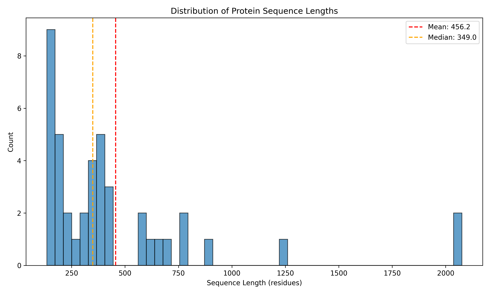

# JClinic Coding/Research Assignment

### Setup
```bash
uv sync
source .venv/bin/activate
```

### Data Parsing
File: [src/dataset.py](src/dataset.py)
- I used Biopython to parse PDB files and extract Calpha coordinates + residues.
- I use the same Dataset Class for both embedding and training the SchNet model, so there is a `mode` attribute to switch between the two modes.
- Basically, in the embedding mode, we only need the Residue sequence, whereas in training, we need the embeddings and their coordinates (to create the graph).
- The `EmbeddingCollator` collates sequences into padded tensors for batch processing.
- I drop proteins with sequence lengths > 1024, as the ESM2 model has a max length of 1024 tokens.
- This drops 3 proteins, which is a a lot for this dataset ([handling long sequences](#handling-longer-sequences)).



### Embedding with ESM2
File: [src/embed.py](src/embed.py)
- This script loads a pre-trained ESM2 model and generates embeddings for protein sequences.
- The embeddings are saved alongside the Calpha coordinates for later use in training the SchNet model.
- This runs quite fast on my MacBook's MPS accelerator (~1.2 proteins / s, can be increased a bit by playing around with the batch size).

### SchNet Model
File: [src/model.py](src/model.py)
- I had to modify the original SchNet implementation to work with input embeddings rather than atom types, i.e., instead of learning an embedding layer for atom types, I directly use the ESM2 embeddings + a linear layer.
- I used 20Å as the cutoff distance for the SchNet model.
- I also wrapped it around with a linear head that maps the SchNet output to the desired output dimension (1).

### Training and Evaluation
File: [src/train.py](src/train.py)
- Standard training loop with MSE loss and Adam optimizer.
- I used Leave-One-Out Cross-Validation (LOOCV) for evaluation, given the small dataset size (39 proteins).
- The results are summarized below (the exact predictions are in [results/predictions.csv](results/predictions.csv)):
```bash
============================================================
LOOCV Results Summary
============================================================
  MSE:      792.2666
  RMSE:     28.1472
  MAE:      13.3699
  R²:       0.8368
  Pearson:  0.9170
  Spearman: 0.9115
============================================================
```
- The model's training loss went down for all 39 folds, but the validation loss was quite noisy. (I have not added these plots here because of space)
- At this stage, it is quite hard to meaningfully test if the model is learning something or if the ESM2 embeddings are just that good.

## Discussion

### Deployment Considerations
- I think the main production issue is that there are two models which need to be run sequentially: first the ESM2 model to get embeddings, then the SchNet model for property prediction.
- The ESM2 model is quite large and may require significant computational resources, especially for longer sequences.
- The simplest solution is literal caching for previously seen sequences.
- A more involved solution is to use something like distillation or quantization to reduce the size of the ESM2 model. (This would not only change the embeddings, but also the downstream SchNet model would need to be retrained on the new embeddings)
- This also brings up the issue that in case the embedding model is upgraded / changed in any way, the downstream model would need to be retrained.

### Handling Longer Sequences
- The current approach drops proteins with sequences longer than 1024 residues due to ESM2's limitations.
- The simplest method for this one is to scale the RoPE embeddings differently to accomodate longer sequences.
- For example
```python
>>> print(model.encoder.layer[0].attention.self.rotary_embeddings.inv_freq)
tensor([1.0000e+00, 7.5000e-01, 5.6250e-01, 4.2163e-01, 3.1616e-01, 2.3718e-01,
        1.7786e-01, 1.3330e-01, 9.9976e-02, 7.5012e-02, 5.6244e-02, 4.2175e-02,
        3.1616e-02, 2.3712e-02, 1.7776e-02, 1.3336e-02, 1.0002e-02, 7.4997e-03,
        5.6229e-03, 4.2152e-03, 3.1624e-03, 2.3708e-03, 1.7786e-03, 1.3332e-03,
        1.0004e-03, 7.5006e-04, 5.6219e-04, 4.2176e-04, 3.1614e-04, 2.3711e-04,
        1.7786e-04, 1.3340e-04])
```
This is the inverse frequencies used for RoPE. By scaling these values down (e.g., multiplying by 0.5), we can effectively double the maximum sequence length that can be handled.
